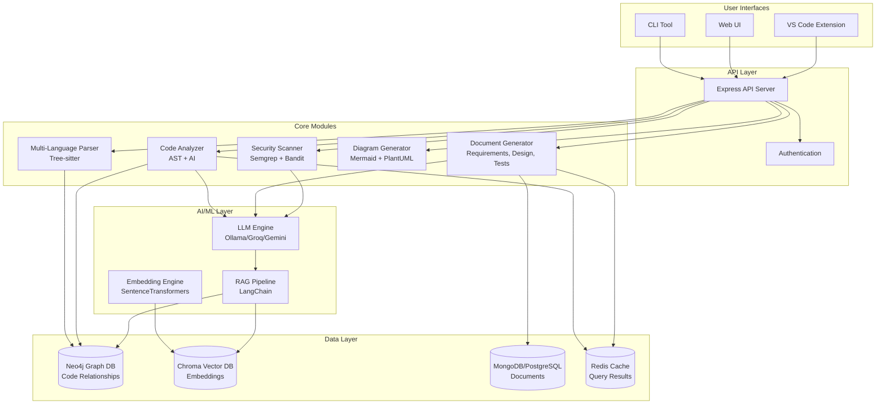
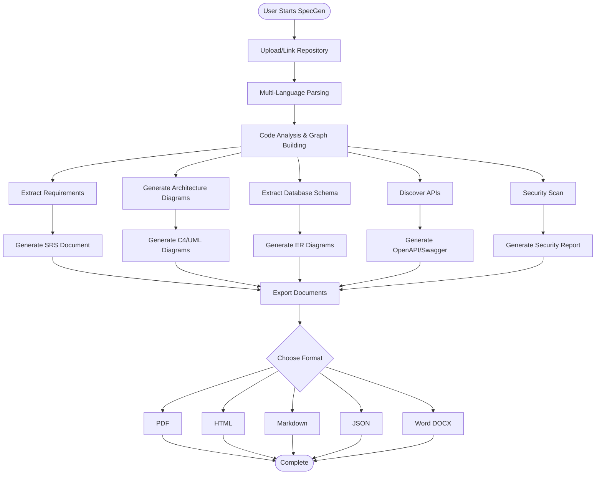

# SpecGen - Complete Project Guide

> **Generate complete specs from any code**  
> The ultimate reverse engineering platform that transforms existing code into comprehensive SDLC documentation

---

## 🎯 Project Overview

**SpecGen** is a reverse engineering platform that takes ANY existing codebase (regardless of language or tech stack) and automatically generates ALL Software Development Life Cycle (SDLC) documentation that should have been created during development.

### The Problem We Solve

Most legacy systems, acquired codebases, and even modern applications lack proper documentation:
- ❌ No Software Requirements Specification (SRS)
- ❌ No High-Level Design (HLD) or Low-Level Design (LLD)
- ❌ No up-to-date API documentation
- ❌ No test plans or security audit reports
- ❌ No architecture diagrams or database schemas

### Our Solution

**Input:** Any codebase (C, C++, COBOL, Java, JavaScript, TypeScript, Python, Go, Ruby, PHP, or full-stack MEAN/MERN/JAMstack)

**Output:** 30+ SDLC documents including:
- Software Requirements Specification (SRS)
- Functional & Non-Functional Requirements
- High-Level & Low-Level Design Documents
- Architecture Diagrams (C4, UML, Sequence)
- Database Schema & ER Diagrams
- API Documentation (REST, GraphQL, WebSocket)
- Security Audit Reports (OWASP Top 10, CVE scanning)
- Test Plans & Test Cases
- Deployment Guides & Operations Manuals
- Compliance Reports (GDPR, HIPAA, PCI-DSS)

---

## 🔄 What is Reverse Engineering?

### Traditional Software Development (Forward Engineering)
```
Requirements → Design → Code → Testing → Deployment
```

### Reverse Engineering with SpecGen
```
Deployed Code → Analyze → Generate ALL SDLC Documentation
```

### Real-World Scenario Example

**Scenario:** You acquire a legacy Java banking application that's been running in production for 5 years. Zero documentation exists.

**Traditional Approach:**
- 6-12 months of manual code reading
- Interviewing original developers (if available)
- Trial-and-error testing
- Cost: $100K-$500K

**SpecGen Approach:**
1. Upload the codebase
2. SpecGen analyzes 200K lines of Java code
3. In 30 minutes, you receive:
   - Complete SRS with 150+ functional requirements
   - High-Level Design with C4 architecture diagrams
   - Database schema documentation (50+ tables)
   - REST API documentation (200+ endpoints)
   - Security audit report (12 vulnerabilities found)
   - Test plan with 500+ auto-generated test cases
   - Compliance report (GDPR, PCI-DSS analysis)

**Cost:** $0 (free tier) or minimal compute costs

---

## 📦 Complete Output (30+ Documents)

### 1️⃣ Requirements Phase
| Document | Description | Format |
|----------|-------------|--------|
| **Software Requirements Specification (SRS)** | IEEE 830 compliant, functional/non-functional requirements | PDF, Markdown, Word |
| **Business Requirements Document (BRD)** | High-level business goals inferred from code patterns | PDF, Markdown |
| **Functional Specification Document (FSD)** | Detailed feature specifications with use cases | PDF, Markdown |
| **User Stories & Use Cases** | Extracted from endpoints, UI components, business logic | Markdown, Excel |
| **Requirements Traceability Matrix** | Maps requirements to code implementation | Excel, CSV |

### 2️⃣ Design & Architecture Phase
| Document | Description | Format |
|----------|-------------|--------|
| **High-Level Design (HLD)** | System architecture with C4 model diagrams | PDF, Mermaid, PlantUML |
| **Low-Level Design (LLD)** | Class diagrams, component interactions, algorithms | PDF, UML |
| **Architecture Diagrams** | System context, container, component, deployment | PNG, SVG, Mermaid |
| **Sequence Diagrams** | Request flows, integration patterns | PNG, SVG, PlantUML |
| **Design Patterns Report** | Detected patterns (Singleton, Factory, Observer, etc.) | Markdown, PDF |

### 3️⃣ Database Phase
| Document | Description | Format |
|----------|-------------|--------|
| **Database Schema Documentation** | Tables, columns, data types, constraints | Markdown, HTML |
| **ER Diagrams** | Entity-Relationship diagrams with cardinality | PNG, SVG, Mermaid |
| **Data Dictionary** | Complete field definitions, validation rules | Excel, CSV |
| **Database Design Document** | Indexes, foreign keys, normalization analysis | PDF, Markdown |

### 4️⃣ API Documentation Phase
| Document | Description | Format |
|----------|-------------|--------|
| **REST API Documentation** | OpenAPI/Swagger spec with endpoints, payloads | JSON, YAML, HTML |
| **GraphQL Schema** | Types, queries, mutations, subscriptions | GraphQL SDL, HTML |
| **WebSocket API Documentation** | Events, message formats, connection flows | Markdown, HTML |
| **API Integration Guide** | Authentication, rate limits, examples | Markdown, PDF |

### 5️⃣ Code Quality Phase
| Document | Description | Format |
|----------|-------------|--------|
| **Code Quality Metrics** | Cyclomatic complexity, maintainability index | HTML, JSON |
| **Code Smells Report** | Long methods, duplicated code, god classes | HTML, Markdown |
| **Technical Debt Assessment** | Quantified debt with remediation priorities | PDF, Markdown |
| **Dependency Analysis** | Third-party libraries, version analysis, licenses | JSON, HTML |

### 6️⃣ Security Phase
| Document | Description | Format |
|----------|-------------|--------|
| **Security Audit Report** | OWASP Top 10 vulnerabilities, CVE scanning | PDF, HTML |
| **Vulnerability Assessment** | SQL injection, XSS, CSRF, authentication flaws | PDF, JSON |
| **Secrets Detection Report** | Hardcoded credentials, API keys, tokens | JSON, Markdown |
| **Security Best Practices Checklist** | Compliance with security standards | PDF, Markdown |

### 7️⃣ Testing Phase
| Document | Description | Format |
|----------|-------------|--------|
| **Test Plan** | Testing strategy, scope, schedule, resources | PDF, Markdown |
| **Unit Test Cases** | Auto-generated test cases for all functions | Markdown, Excel |
| **Integration Test Cases** | API endpoint tests, database interaction tests | Markdown, Excel |
| **E2E Test Cases** | User flow testing scenarios | Markdown, Excel |
| **Test Coverage Report** | Line coverage, branch coverage metrics | HTML, JSON |

### 8️⃣ Deployment & Operations Phase
| Document | Description | Format |
|----------|-------------|--------|
| **Deployment Guide** | Step-by-step deployment instructions | Markdown, PDF |
| **Operations Manual** | Monitoring, troubleshooting, maintenance | PDF, Markdown |
| **Infrastructure Documentation** | Server configs, environment variables, ports | Markdown, YAML |
| **CI/CD Pipeline Documentation** | Build, test, deploy automation | Markdown, PDF |

### 9️⃣ User Documentation Phase
| Document | Description | Format |
|----------|-------------|--------|
| **User Manual** | End-user guide with screenshots (UI-based) | PDF, HTML |
| **Administrator Guide** | System admin tasks, user management | PDF, Markdown |
| **FAQ Document** | Common questions inferred from code patterns | Markdown, HTML |

### 🔟 Project Management Phase
| Document | Description | Format |
|----------|-------------|--------|
| **Work Breakdown Structure (WBS)** | Project phases, tasks, milestones | Excel, Markdown |
| **Project Timeline** | Estimated development timeline based on code size | Gantt chart, Markdown |

### 1️⃣1️⃣ Compliance Phase
| Document | Description | Format |
|----------|-------------|--------|
| **GDPR Compliance Report** | Personal data handling analysis | PDF, Markdown |
| **HIPAA Compliance Report** | Healthcare data protection analysis | PDF, Markdown |
| **PCI-DSS Compliance Report** | Payment card data security analysis | PDF, Markdown |

---

## 🚀 Core Features

### 1. Repository Analyzer & Tech Stack Detection
- **Multi-Language Parsing:** Universal code parsing using Tree-sitter (C, C++, Java, JavaScript, TypeScript, Python, Go, Ruby, PHP, COBOL)
- **Dependency Graph:** Extract imports, exports, function calls, class hierarchies
- **Framework Detection:** Auto-detect Express, React, Spring Boot, Django, FastAPI, Rails, Laravel
- **Database Detection:** PostgreSQL, MySQL, MongoDB, Redis from connection strings and queries

### 2. Architecture & Schema Diagram Generation
- **C4 Model Diagrams:** System Context, Container, Component, Code level
- **Sequence Diagrams:** Request-response flows, authentication flows
- **ER Diagrams:** Database relationships with cardinality
- **Class Diagrams:** UML diagrams for OOP codebases
- **Output Formats:** Mermaid.js (live editable), PlantUML, PNG, SVG

### 3. Code Summarization + AI Q&A Chatbot
- **RAG (Retrieval Augmented Generation):** Vector embeddings for semantic code search
- **Natural Language Queries:**
  - "How does the payment processing work?"
  - "What databases are used and where?"
  - "List all API endpoints related to user authentication"
- **Context-Aware Responses:** AI understands codebase context via embeddings
- **Local LLM Support:** Ollama (Llama 3.1, CodeLlama) for 100% offline mode

### 4. Code Review + Refactoring + Vulnerability Analysis
- **Automated Code Review:**
  - Code smells detection (long methods, duplicate code, god classes)
  - Design pattern violations
  - Performance anti-patterns (N+1 queries, inefficient loops)
- **Security Scanning:**
  - OWASP Top 10 vulnerabilities
  - CVE database scanning
  - Secrets detection (hardcoded passwords, API keys)
  - SQL injection, XSS, CSRF analysis
- **Refactoring Suggestions:**
  - Complexity reduction
  - SOLID principles violations
  - Modernization recommendations

### 5. API Extraction & Documentation
- **REST API Discovery:**
  - Express.js: `app.get/post/put/delete`
  - Spring Boot: `@GetMapping/@PostMapping`
  - Django/Flask: `@app.route`
  - FastAPI: `@app.get/@app.post`
- **GraphQL Schema Extraction:**
  - Types, queries, mutations, resolvers
- **WebSocket Detection:**
  - Socket.io events, message formats
- **Auto-Generated OpenAPI/Swagger:**
  - Request/response schemas
  - Authentication requirements
  - Example payloads

---

## 🛠️ Technology Stack (100% Free)

### Frontend (Web UI)
| Technology | Purpose | Cost |
|------------|---------|------|
| **React 18** | UI framework | FREE |
| **TypeScript** | Type safety | FREE |
| **Vite** | Build tool | FREE |
| **Tailwind CSS** | Styling | FREE |
| **shadcn/ui** | Component library | FREE |
| **Cytoscape.js** | Graph visualization (architecture diagrams) | FREE |
| **Monaco Editor** | Code viewer (VS Code's editor) | FREE |
| **Mermaid.js** | Diagram rendering | FREE |

### Backend (API Server)
| Technology | Purpose | Cost |
|------------|---------|------|
| **Node.js 20+** | Runtime | FREE |
| **TypeScript** | Type safety | FREE |
| **Express** | Web framework | FREE |
| **Tree-sitter** | Multi-language parsing | FREE |
| **@babel/parser** | JavaScript/TypeScript parsing | FREE |
| **JavaParser** | Java parsing | FREE |
| **ast (Python)** | Python parsing | FREE |

### AI/ML Stack
| Technology | Purpose | Cost |
|------------|---------|------|
| **Ollama** | Local LLM runtime (Llama 3.1, CodeLlama, DeepSeek) | FREE |
| **Groq API** | Cloud LLM (Llama 3.1 70B, fastest inference) | FREE (6000 RPM) |
| **Google Gemini Flash** | Cloud LLM (fast, 1M context) | FREE (15 RPM) |
| **Hugging Face Inference API** | Cloud LLM (CodeLlama, StarCoder) | FREE (rate limited) |
| **SentenceTransformers** | Local embeddings (all-MiniLM-L6-v2) | FREE |
| **LangChain** | LLM orchestration framework | FREE |
| **LlamaIndex** | RAG framework | FREE |

### Databases
| Technology | Purpose | Cost |
|------------|---------|------|
| **Neo4j Community** | Graph database (code relationships) | FREE |
| **Chroma** | Vector database (embeddings) | FREE |
| **Qdrant** | Vector database (alternative) | FREE |
| **MongoDB Atlas** | Document storage (512MB free) | FREE |
| **PostgreSQL + pgvector** | Relational + vector search | FREE |
| **SQLite** | Local file-based database | FREE |

### Security & Code Analysis
| Technology | Purpose | Cost |
|------------|---------|------|
| **Semgrep** | Static analysis (multi-language) | FREE |
| **Bandit** | Python security scanner | FREE |
| **npm audit** | JavaScript vulnerability scanner | FREE |
| **OWASP Dependency-Check** | CVE scanning | FREE |
| **ESLint** | JavaScript linter | FREE |
| **Pylint** | Python linter | FREE |
| **SonarQube Community** | Code quality analysis | FREE |

### Diagram Generation
| Technology | Purpose | Cost |
|------------|---------|------|
| **Mermaid.js** | Flowcharts, sequence, ER, C4 diagrams | FREE |
| **PlantUML** | UML diagrams (class, component) | FREE |
| **D2** | Modern declarative diagrams | FREE |

### Hosting & Deployment (Free Tier)
| Service | Purpose | Free Tier |
|---------|---------|-----------|
| **Vercel** | Frontend hosting | Unlimited personal projects |
| **Render** | Backend hosting | 750 hours/month |
| **Fly.io** | Backend hosting (alternative) | 3 shared-CPU-1x, 256MB RAM |
| **MongoDB Atlas** | Database hosting | 512MB storage |
| **Supabase** | PostgreSQL hosting | 500MB storage |
| **Cloudflare Pages** | Frontend hosting (alternative) | Unlimited sites |

### DevOps & CI/CD
| Technology | Purpose | Cost |
|------------|---------|------|
| **GitHub Actions** | CI/CD pipeline | 2000 minutes/month free |
| **Docker** | Containerization | FREE |
| **Docker Hub** | Container registry | 1 private repo free |

**Total Monthly Cost:** **$0** (using local mode + free tiers)

---

## 🏗️ System Architecture

### High-Level Architecture



### Module Breakdown

#### Module 1: Repository Analyzer + Tech Stack Detection
- **Input:** Git URL, local path, or zip file
- **Process:**
  1. Clone/extract repository
  2. Detect languages (file extensions + content analysis)
  3. Parse all files using Tree-sitter
  4. Build Abstract Syntax Tree (AST)
  5. Extract imports, exports, function calls
  6. Detect frameworks (Express, React, Django, Spring Boot)
  7. Identify databases (connection strings, ORM models)
- **Output:** Code graph stored in Neo4j

#### Module 2: Architecture & Schema Diagram Generation
- **Input:** Code graph from Neo4j
- **Process:**
  1. Identify system components (frontend, backend, database, APIs)
  2. Analyze dependencies and data flows
  3. Extract database schemas (tables, columns, relationships)
  4. Generate C4 diagrams (4 levels)
  5. Generate sequence diagrams for critical flows
  6. Generate ER diagrams from database schemas
  7. Render as Mermaid.js or PlantUML
- **Output:** Interactive diagrams (SVG, PNG, editable Mermaid code)

#### Module 3: Code Summarization + Q&A Chatbot
- **Input:** Codebase + user questions
- **Process:**
  1. Chunk code into semantic blocks (functions, classes, modules)
  2. Generate embeddings using SentenceTransformers
  3. Store embeddings in Chroma vector database
  4. User query → embed query → semantic search
  5. Retrieve top-k relevant code chunks
  6. Send to LLM with context (RAG pattern)
  7. LLM generates natural language answer
- **Output:** Conversational answers about codebase

#### Module 4: Code Review + Refactoring + Vulnerability Analysis
- **Input:** Parsed code (AST)
- **Process:**
  1. **Code Quality:** Run ESLint, Pylint, detect code smells
  2. **Security:** Run Semgrep rules (OWASP Top 10)
  3. **Vulnerabilities:** Check dependencies against CVE database
  4. **Secrets:** Scan for hardcoded passwords, API keys
  5. **Performance:** Detect N+1 queries, inefficient loops
  6. **AI Analysis:** LLM reviews complex functions for issues
- **Output:** Annotated code with issues, severity, remediation

#### Module 5: API Extraction + Multi-Language Support
- **Input:** Backend code (Express, Spring, Django, FastAPI)
- **Process:**
  1. Parse route definitions (`app.get`, `@GetMapping`, `@app.route`)
  2. Extract HTTP method, path, parameters
  3. Analyze request/response handling
  4. Identify authentication middleware
  5. Extract validation rules (Joi, Zod, class-validator)
  6. Generate OpenAPI 3.0 specification
  7. For GraphQL: parse schema files and resolvers
- **Output:** OpenAPI/Swagger JSON, GraphQL SDL

---

## 👤 User Flows

### Primary Flow: Complete Reverse Engineering



### Secondary Flows

#### Flow 2: Incremental Re-Analysis
```
Code Update → Re-parse Changed Files → Update Documentation → Highlight Changes
```

#### Flow 3: AI Q&A Chatbot
```
User Question → Embed Query → Semantic Search → Retrieve Code Chunks → LLM Answer
```

#### Flow 4: Local/Offline Mode
```
Install Ollama → Download Llama 3.1 Model → Start SpecGen → 100% Offline Analysis
```

#### Flow 5: CI/CD Integration
```
Git Commit → Trigger SpecGen → Generate Docs → Publish to Confluence/Wiki
```

---

## 🧠 Requirements Extraction Methodology

### How SpecGen Infers Requirements from Code

#### Functional Requirements Extraction

| Code Pattern | Extracted Requirement | Example |
|--------------|----------------------|---------|
| **API Endpoint** | Feature requirement | `app.post('/api/users/login')` → "The system shall allow users to log in via email and password" |
| **Database Table** | Data requirement | `CREATE TABLE orders` → "The system shall store order information including order_id, user_id, total_amount, status" |
| **Business Logic** | Business rule | `if (age >= 18)` → "The system shall restrict access to users aged 18 and above" |
| **UI Component** | User interface requirement | `<PaymentForm />` → "The system shall provide a payment form interface" |
| **Integration** | Integration requirement | `axios.post('https://stripe.com/api')` → "The system shall integrate with Stripe payment gateway" |

#### Non-Functional Requirements Extraction

| Code Pattern | Extracted NFR | Example |
|--------------|---------------|---------|
| **Caching** | Performance | `redis.get(key)` → "The system shall cache frequently accessed data for improved performance" |
| **Authentication** | Security | `passport.authenticate('jwt')` → "The system shall use JWT-based authentication" |
| **Database Indexing** | Performance | `CREATE INDEX idx_user_email` → "The system shall optimize user lookups by email" |
| **Load Balancing** | Scalability | `nginx.conf: upstream backend` → "The system shall support horizontal scaling via load balancing" |
| **Error Handling** | Reliability | `try-catch blocks` → "The system shall handle errors gracefully with proper logging" |

#### AI-Powered Inference

For complex business logic, SpecGen uses LLMs to infer higher-level requirements:

**Example Code:**
```javascript
function calculateLoanEligibility(user) {
  const creditScore = user.creditScore;
  const income = user.annualIncome;
  const debtToIncomeRatio = user.totalDebt / income;
  
  if (creditScore >= 700 && debtToIncomeRatio < 0.4 && income >= 50000) {
    return { eligible: true, maxAmount: income * 3 };
  }
  return { eligible: false, reason: "Does not meet eligibility criteria" };
}
```

**SpecGen AI Inference:**
> **Functional Requirement FR-101:** The system shall calculate loan eligibility based on credit score, annual income, and debt-to-income ratio.
> 
> **Business Rule BR-101.1:** Users with credit score ≥ 700, debt-to-income ratio < 0.4, and annual income ≥ $50,000 shall be eligible for loans.
> 
> **Business Rule BR-101.2:** Maximum loan amount shall be calculated as 3x the user's annual income.

---

## 🌍 Multi-Language Support

| Language | Parser | Frameworks Detected | Status |
|----------|--------|---------------------|--------|
| **JavaScript** | Tree-sitter, Babel | Express, Koa, Nest.js, React, Vue, Angular | ✅ Supported |
| **TypeScript** | Tree-sitter, TS Compiler API | Express, Nest.js, Next.js, React, Angular | ✅ Supported |
| **Python** | Tree-sitter, ast module | Django, Flask, FastAPI, PyTorch, TensorFlow | ✅ Supported |
| **Java** | Tree-sitter, JavaParser | Spring Boot, Spring MVC, Hibernate, Jakarta EE | ✅ Supported |
| **C** | Tree-sitter | Embedded systems, Linux kernel patterns | ✅ Supported |
| **C++** | Tree-sitter | Qt, Boost, Standard Library | ✅ Supported |
| **Go** | Tree-sitter | Gin, Echo, Fiber, gRPC | ✅ Supported |
| **Ruby** | Tree-sitter | Rails, Sinatra | ✅ Supported |
| **PHP** | Tree-sitter | Laravel, Symfony, WordPress | ✅ Supported |
| **COBOL** | Tree-sitter | Legacy mainframe patterns | ✅ Supported |
| **Rust** | Tree-sitter | Actix, Rocket, Tokio | 🔄 Planned |
| **C#** | Tree-sitter | ASP.NET Core, Entity Framework | 🔄 Planned |

---

## 🎯 Use Cases & Target Audience

### Use Case 1: Legacy System Modernization
**Scenario:** Insurance company has 500K lines of COBOL code running on mainframes. Need to migrate to cloud.

**SpecGen Solution:**
1. Upload COBOL codebase
2. Generate complete requirements documentation
3. Extract business rules and logic flows
4. Create architecture diagrams showing system components
5. Identify modernization candidates (monolith → microservices)
6. Export documentation for development teams

**Time Saved:** 6-12 months → 2-4 weeks  
**Cost Saved:** $500K → $5K

### Use Case 2: Mergers & Acquisitions Due Diligence
**Scenario:** Tech company acquiring startup. Need to evaluate codebase quality before acquisition.

**SpecGen Solution:**
1. Analyze acquired company's code (GitHub access)
2. Generate security audit report (vulnerabilities, secrets)
3. Code quality metrics (technical debt, complexity)
4. Architecture documentation (understand system design)
5. API documentation (integration assessment)
6. Test coverage analysis

**Deliverable:** Complete due diligence report in 48 hours

### Use Case 3: Compliance Audits (GDPR, HIPAA, PCI-DSS)
**Scenario:** Healthcare SaaS needs HIPAA compliance audit for enterprise client.

**SpecGen Solution:**
1. Scan codebase for personal health information (PHI) handling
2. Identify data storage, encryption, access controls
3. Generate HIPAA compliance report
4. Highlight non-compliant code patterns
5. Provide remediation recommendations

**Result:** Pass compliance audit on first attempt

### Use Case 4: Developer Onboarding
**Scenario:** New developer joins team working on 10-year-old codebase. No documentation.

**SpecGen Solution:**
1. Generate high-level architecture overview
2. Create API documentation for all endpoints
3. Provide AI chatbot for Q&A ("How does authentication work?")
4. Generate sequence diagrams for critical flows
5. Explain design patterns used

**Onboarding Time:** 4-6 weeks → 3-5 days

### Use Case 5: Open Source Project Documentation
**Scenario:** Popular open-source library with 50+ contributors. Documentation outdated.

**SpecGen Solution:**
1. Auto-generate API reference from code
2. Create usage examples from test files
3. Generate architecture diagrams
4. Keep documentation in sync with code (CI/CD integration)

**Maintenance Time:** 20 hours/week → 0 hours (automated)

### Target Audience

| Audience | Pain Point | SpecGen Benefit |
|----------|-----------|-----------------|
| **Enterprise CTOs** | Legacy systems without docs, M&A due diligence | Complete documentation in days, not months |
| **DevOps Engineers** | No deployment/operations manuals | Auto-generated deployment guides |
| **Security Teams** | Manual security audits are slow | Automated OWASP Top 10 scanning + reports |
| **QA Engineers** | No test plans for legacy systems | Auto-generated test cases |
| **Technical Writers** | Manually writing API docs is tedious | Auto-generated OpenAPI/Swagger |
| **Consultants** | Need to understand client codebases fast | AI chatbot + architecture diagrams |
| **Compliance Officers** | Manual GDPR/HIPAA compliance checks | Automated compliance reports |

---

## 🗺️ MVP Roadmap

### Phase 1: Core Parser + Requirements Extraction (Weeks 1-4)
**Goal:** Prove the concept with basic reverse engineering

- ✅ Set up Node.js + TypeScript project structure
- ✅ Integrate Tree-sitter for JavaScript/TypeScript parsing
- ✅ Build code graph in Neo4j
- ✅ Implement basic requirements extraction (functional only)
- ✅ Generate simple SRS document (Markdown)
- ✅ CLI tool: `specgen analyze ./my-project`

**Deliverable:** CLI tool that generates basic SRS from JavaScript code

---

### Phase 2: AI Integration + Diagrams (Weeks 5-8)
**Goal:** Add intelligence and visualization

- ✅ Integrate Ollama for local LLM
- ✅ Implement RAG pipeline (LangChain + Chroma)
- ✅ AI-powered requirements inference
- ✅ Generate C4 architecture diagrams (Mermaid.js)
- ✅ Generate sequence diagrams
- ✅ AI Q&A chatbot (CLI-based)

**Deliverable:** Enhanced CLI with AI-powered docs + diagrams

---

### Phase 3: Multi-Language + Security (Weeks 9-12)
**Goal:** Expand language support and add security scanning

- ✅ Add Python, Java, Go parsers
- ✅ Integrate Semgrep for security scanning
- ✅ Generate security audit reports
- ✅ Add API extraction (REST + GraphQL)
- ✅ Generate OpenAPI/Swagger documentation
- ✅ Database schema extraction + ER diagrams

**Deliverable:** Production-ready CLI for 5+ languages

---

### Phase 4: Web UI + Export Formats (Weeks 13-16)
**Goal:** Build user-friendly web interface

- ✅ React + TypeScript + Vite frontend
- ✅ Dashboard with project overview
- ✅ Interactive architecture diagrams (Cytoscape.js)
- ✅ AI chatbot interface
- ✅ Export to PDF, Word, HTML, Markdown, JSON
- ✅ Deploy to Vercel (frontend) + Render (backend)

**Deliverable:** Full-stack web application (MVP)

---

### Post-MVP: Advanced Features (Weeks 17+)
- VS Code extension
- CI/CD integration (GitHub Actions, GitLab CI)
- Team collaboration (shared projects)
- Confluence/Notion integration
- Custom report templates
- Incremental analysis (only re-analyze changed files)
- Support for 10+ languages (C#, Rust, Kotlin, Swift)

---

## 🚀 Getting Started

### Prerequisites
- **Node.js 20+** (for backend)
- **Python 3.10+** (for parsers)
- **Git** (for repository cloning)
- **Docker** (optional, for Neo4j)

### Installation (CLI)

```bash
# Clone the repository
git clone https://github.com/yourusername/specgen.git
cd specgen

# Install dependencies
npm install

# Install Tree-sitter parsers
npm run install-parsers

# (Optional) Install Ollama for local LLM
# Visit https://ollama.ai and follow installation instructions
ollama pull llama3.1

# (Optional) Start Neo4j (Docker)
docker run -d \
  --name neo4j \
  -p 7474:7474 -p 7687:7687 \
  -e NEO4J_AUTH=neo4j/password \
  neo4j:latest

# Run SpecGen
npm run build
npm link
specgen --help
```

### Usage Examples

```bash
# Analyze a local project
specgen analyze ./my-project --output ./docs

# Generate specific documents
specgen requirements ./my-project --format markdown
specgen architecture ./my-project --diagrams c4,sequence
specgen api ./my-project --format openapi

# Security scan
specgen security ./my-project --report html

# AI chatbot
specgen ask ./my-project "How does authentication work?"

# Export to PDF
specgen export ./my-project --format pdf --output ./report.pdf
```

### Web UI (Coming in Phase 4)

```bash
# Start backend
cd backend
npm run dev

# Start frontend (separate terminal)
cd frontend
npm run dev

# Open browser
http://localhost:5173
```

---

## 📊 Comparison: Traditional vs SpecGen

| Task | Traditional Approach | SpecGen Approach |
|------|---------------------|------------------|
| **Requirements Documentation** | 2-3 months of manual analysis | 30 minutes (automated) |
| **Architecture Diagrams** | 1-2 weeks using Visio/Lucidchart | 5 minutes (auto-generated) |
| **API Documentation** | 1-2 weeks manually writing Swagger | 2 minutes (auto-extracted) |
| **Security Audit** | 1-2 weeks with manual tools | 10 minutes (automated scanning) |
| **Database Documentation** | 3-5 days mapping schemas | 5 minutes (auto-generated ER diagrams) |
| **Test Case Generation** | 2-4 weeks writing test plans | 20 minutes (AI-generated) |
| **Compliance Report (GDPR)** | 1-2 weeks with legal team | 15 minutes (automated analysis) |
| **Developer Onboarding** | 4-6 weeks reading code | 3-5 days with docs + AI chatbot |
| **Total Time** | **3-6 months** | **1-2 days** |
| **Total Cost** | **$50K-$200K** | **$0-$500** |

---

## 🎓 Key Concepts

### What is Reverse Engineering?
**Traditional:** Requirements → Design → Code  
**Reverse:** Code → Design → Requirements

### Why is Documentation Important?
- **Maintenance:** 70% of software cost is maintenance
- **Onboarding:** New developers need context
- **Compliance:** Regulatory audits require documentation
- **Knowledge Transfer:** Avoid bus factor (single point of failure)
- **Technical Debt:** Undocumented systems accumulate debt

### Why SpecGen?
- **Speed:** 100x faster than manual documentation
- **Accuracy:** Code is the source of truth
- **Completeness:** 30+ document types in SDLC
- **Cost:** $0 using free tier + local LLMs
- **Always Up-to-Date:** Regenerate docs on every commit

---

## 📞 Support & Community

- **Documentation:** [Coming Soon]
- **Discord:** [Coming Soon]
- **GitHub Issues:** [Coming Soon]
- **Email:** support@specgen.dev

---

## 📄 License

MIT License - Free to use for personal and commercial projects.

---

**SpecGen** - Because every codebase deserves proper documentation. 🚀

*Last Updated: November 11, 2025*
